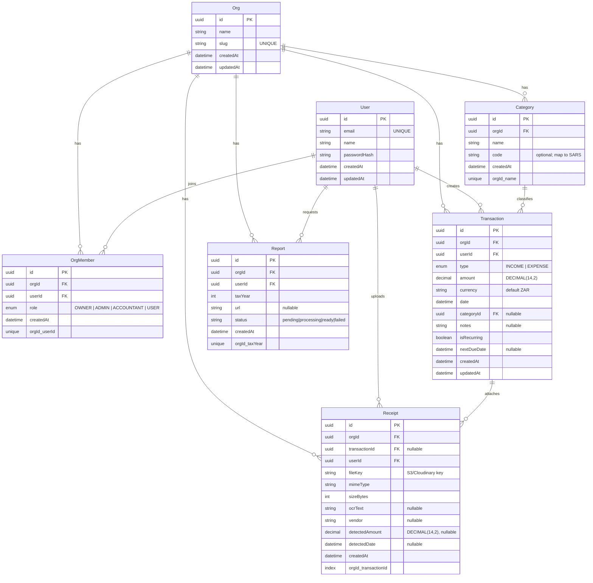
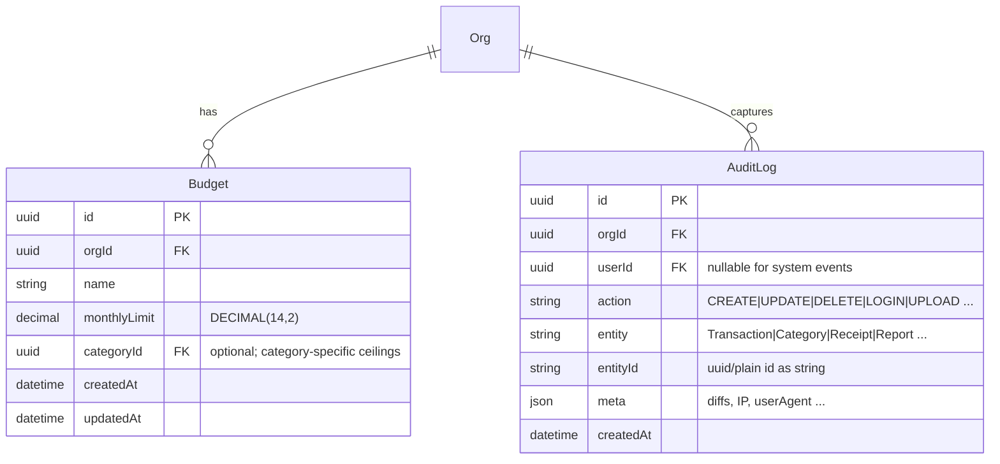

# Budget Tracker App — ER Diagram (Markdown)

This document shows a **visual ER diagram** (Mermaid) of the current MVP data model, plus optional **Phase 2 extensions**.  
Paste into any Mermaid-enabled Markdown viewer (e.g., GitHub, Obsidian with Mermaid, or mermaid.live) to render.

---

## MVP Entities & Relationships



---

## Field Notes
- **Multi-tenancy**: All domain tables carry `orgId` → hard tenant boundary.
- **Money**: Use `DECIMAL(14,2)` for `amount` to avoid float issues.
- **Soft delete**: Not in MVP. Add `deletedAt` later if needed.
- **Auditability**: Keep `createdAt/updatedAt` everywhere by default.
- **Attachments**: `Receipt.fileKey` should be unique if using immutable keys.

---

## Example Prisma Access Patterns

### Create a transaction (EXPENSE)
```ts
await prisma.transaction.create({
  data: {
    orgId,
    userId,
    type: 'EXPENSE',
    amount: 499.99,
    currency: 'ZAR',
    date: new Date(),
    categoryId,       // or null
    notes: 'Groceries at Checkers' // or null
  }
})
```

### This month’s totals
```ts
const start = new Date('2025-09-01')
const end = new Date('2025-10-01')

const grouped = await prisma.transaction.groupBy({
  by: ['type'],
  where: { orgId, date: { gte: start, lt: end } },
  _sum: { amount: true }
})
```

---

## Phase 2 — Optional Extensions (Preview)



**Why these matter**
- **Budget**: power alerts (BullMQ), dashboards (remaining vs spent), category caps.
- **AuditLog**: compliance trail (who did what, when); crucial for accountant view.

---

## Quick Validation Tips
- Validate inputs with **Zod** (`z.coerce.date()`, enums, positive amounts).
- Always **filter by `orgId`** on queries.
- Use indexes for hot filters: `orgId`, `date`, `type` (add in Prisma if needed).
- Prefer **nullable columns** mapped to `null` (not `undefined`) in Prisma writes.

---

**Last updated:** 2025-09-08
